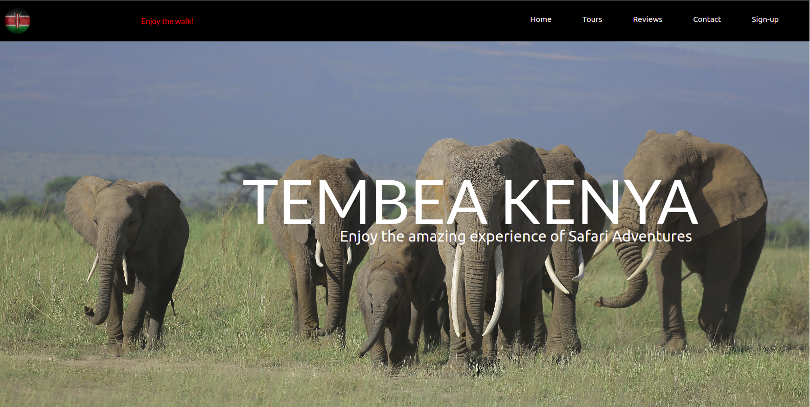
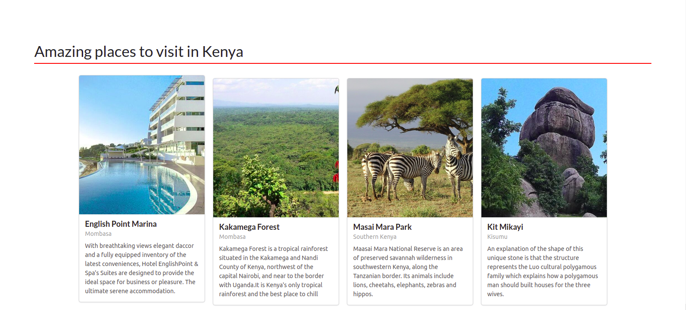
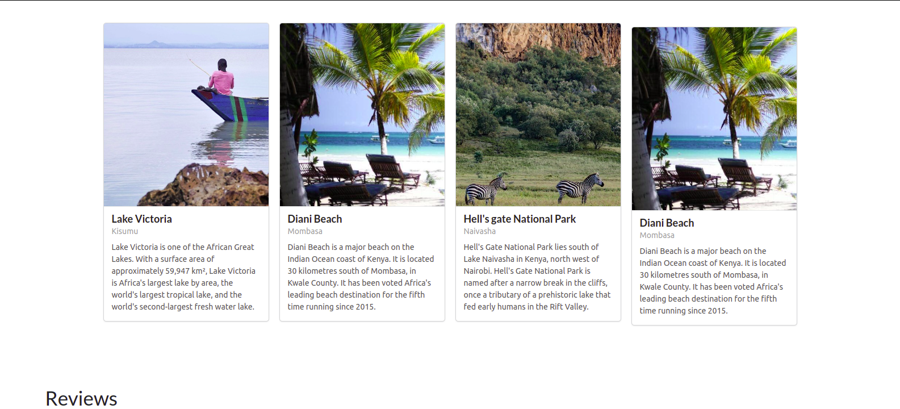
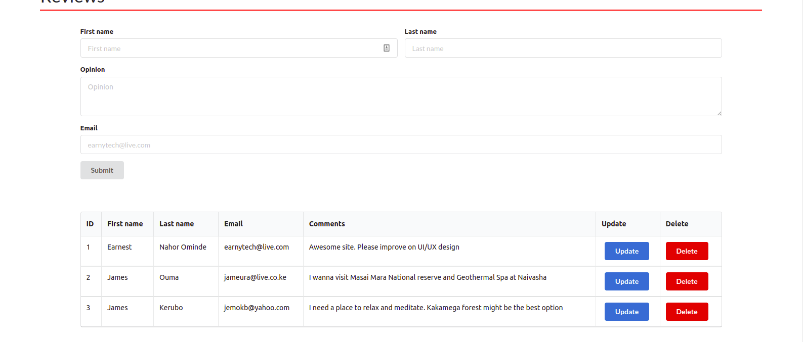
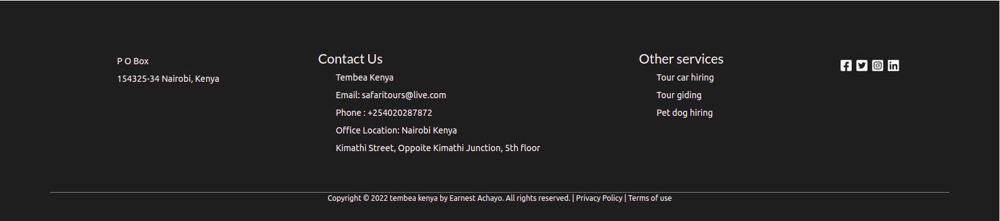

# Tembea Kenya Website

---

### Author : Earnest Achayo Date 29/7/2022

---

## Project Description

This is a simple website to help tourists or local Kenyans to choose amazing places to visit during vacation or picnic times.

---

## SCREENSHOTS

---

## SetUp Instruction

### Requirements

- Text editor eg [Visual Studio Code](https://code.visualstudio.com/download)

### Getting Files

- Fork the repo [LINK.](git@github.com:AchayoEarnest/travel_kenya_project_front_end.git)

* Create a new branch in your terminal (git checkout -b improve-feature)
* Install the prerequisites
* Make appropriate changes in file(s)
* Run the server to see the changes
* Add the changes and commit them (git commit -am "Improve App")
* Push to the branch (git push origin improve-app)
* Create a Pull request

- Open the folder location on terminal and use the following command to run app:

### Features

- Users can upload their opinions and edit by creating, updating and deleting.
- Users can read and view images of the available tourist attraction sites:

## How To Run It

> $ Run it under any browser

---

## Live Link

Or you can access the web application directly via this [LINK.](https://sparkling-rabanadas-ca4e6c.netlify.app/)

---

## Technologies Used

1. JSX
2. CSS
3. React
4. Json
5. React Semantics
6. Mock Api

---

## Contact Information

- Email : earnest.achayo@student.moringaschool.com

---

## [License](LICENSE)

MIT License
Copyright (c) 2022 Earnest Achayo
